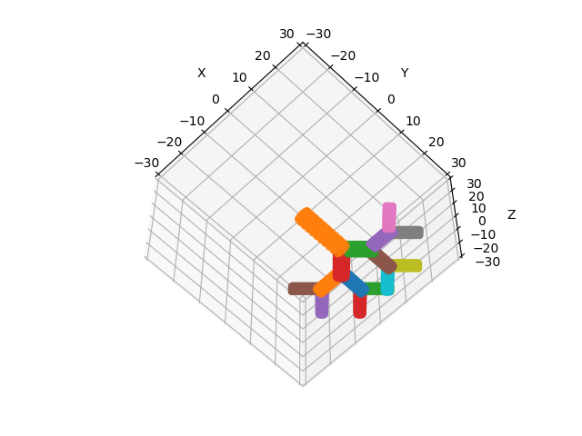

Ce repo contient du code pour modéliser des poumons en 3D à l'aide de Python.

Modèle inspiré de [http://benjamin.mauroy.free.fr/publis/mauroy_these.pdf](http://benjamin.mauroy.free.fr/publis/mauroy_these.pdf).

